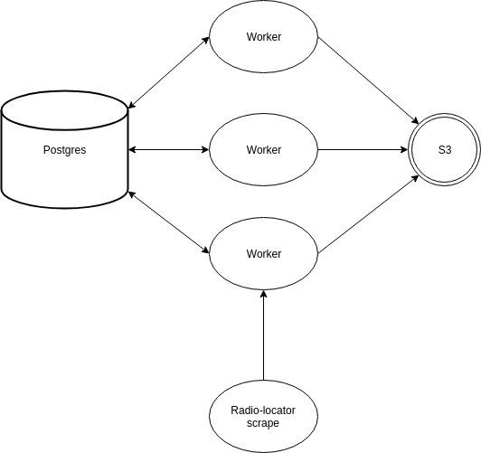

# Talk radio ingest
---

This application ingests audio from radio stations which have online streams and
saves it to an S3 bucket. Various parts of this ingestion process are
configurable: the bucket, the number of ingest workers, the audio chunk size,
and more.

### Setup
You need to do two things to get started:
* Copy `conf.env.template` to `conf.env` and put in your configuration options.
* Create the list of stations to ingest. This is a tab-separated CSV/TSV file
  that needs to be at the path `images/postgres/data/station-data.csv`. (See
  `images/postgres/data/station-data-example.csv` for an example.) It should
  contain 5 columns (in this order):
    * `station_id`, an arbitrary integer ID you can assign;
    * `callsign`, the station callsign;
    * `band`, either 'FM', 'AM' or 'FL' for low-power FM;
    * `stream_url`, the URL to scrape;
    * `auto_ingest`, whether to start ingesting this station immediately on
      startup.

## Usage
There are two ways to deploy and run, both documented in the Makefile:
* For a small number of stations, you can use the provided `docker-compose.yml`
  file to run locally. Run `make local`.
* For a large number of stations, more than one machine can handle, the necessary
  infrastructure is packaged as a CloudFormation template. Run `make deploy`.

## Live editing of target stations
To edit the set of stations marked for ingest once the app is running, there are
two things you can do: 1) stop it, edit the set of stations with the
auto\_ingest flag, rebuild the images and rerun or redeploy, or 2) run a bit of
SQL:
* Connect to the PostgreSQL DB created in the CF template or docker-compose
  file. Insert station\_id values for stations to scrape into the app.jobs
  table, or delete ones that are currently there. Ones which are no longer
  present will stop being ingested, and new ones will be picked up by a worker.
  The list of stations with metadata including URLs and station\_ids is in the
  data.stations table. Note that each worker ingests only one station at a
  time, so you'll need as many workers as there are stations.
* On AWS, there's autoscaling support but no autoscaling policy, so you'll
  have to manually adjust the desired count of worker tasks in the AWS console.

## Architecture and source data
The application architecture at the moment is summarized by the following
diagram:

## Areas for improvement
* No autoscaling: While the ECS cluster has Fargate-managed infrastructure that
  supports autoscaling, there's no actual autoscaling policy defined, just a
  static desired task count. The number of queued jobs has nothing to do
  with the amount of provisioned capacity. If you want to add more tasks once
  the cluster is running, you'll have to edit the desired count in the AWS web
  console.
